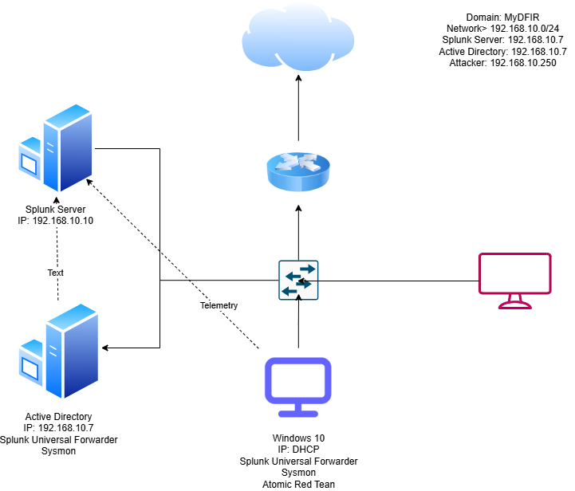

# Active Directory Lab 1.0

This lab simulates a basic Windows Active Directory environment for home lab training. It’s designed to demonstrate core AD setup including domain creation, DNS/DHCP configuration, user/group management, and structured documentation — all built locally using free tools.

---

[My Portfolio](https://stevenloucks.tech) | [LinkedIn](https://www.linkedin.com/in/steven-loucks)

---

## Project Summary – AD Lab 1.0

This home lab project follows the tutorial by MYFDIR and emulates a real-world Active Directory environment using VirtualBox. The goal is to gain hands-on experience with core blue team tools like Filebeat and Splunk, and to simulate attacks using Atomic Red Team.

This setup reflects a simplified but functional SOC lab stack, including:

- A Windows Server acting as a domain controller (AD)
- A Windows 10 client joined to the domain
- A Splunk server running on Ubuntu
- Filebeat forwarding system logs into Splunk
- A Kali Linux VM simulating red team/attacker activity

This lab helps reinforce practical concepts like log collection, system hardening, threat detection, and network segmentation.

---

## Phase Summary

**Phase 1 – Core Build (Complete)**
- Domain Controller with DNS/DHCP successfully configured
- Windows 10 client added to domain
- Basic user and OU structure created
- First diagram embedded above

**Phase 2 – Expansion (In Progress)**
- Second diagram being designed
- Screenshots, ADUC examples, and group policy testing coming
- Will document realistic user hierarchy and group structure

---

## Lab Goals

- Set up a virtualized AD Domain Controller using Windows Server 2019
- Configure DNS and DHCP within the domain
- Create and organize Organizational Units (OUs)
- Add users and security groups manually
- Visualize and document the topology using draw.io

---

## Tools Used

- VirtualBox – virtualization platform for lab VM management
- Windows Server 2019 – Active Directory Domain Controller
- Windows 10 – domain-joined client workstation
- Ubuntu Server 22.04 – log aggregation and analysis system
- Filebeat – forwards system logs to Splunk
- UFW – applied host-level firewall rules to restrict Splunk and SSH access to lab-only IPs
- draw.io – used to create and maintain network topology diagrams
- Kali Linux – attacker simulation system (planned for Atomic Red Team use)

---

## Lab Hardening: UFW Firewall

UFW (Uncomplicated Firewall) was enabled on the Ubuntu Splunk server to restrict access to lab-only IPs. Only 192.168.10.x machines can reach ports 22 (SSH), 8000 (Splunk Web), and 8088 (HEC). This prevents accidental exposure while keeping updates and internal lab traffic functional.

---

## Planned Expansion: Advanced Virtual Firewall

To enhance realism and network segmentation in future phases, this lab may include a dedicated virtual firewall such as pfSense or a Linux bridge. This would allow deeper packet inspection, NAT management, and perimeter control beyond basic host-based rules, simulating an enterprise-level security boundary.

---

## Key Learning Outcomes

- Installed and configured Windows Server AD from scratch
- Practiced DNS and DHCP service setup in a domain
- Gained experience managing users, groups, and OUs
- Built diagrams to represent lab network and system relationships
- Documented a working example suitable for resume/portfolio use

---

## Portfolio

[← Return to my Cybersecurity Portfolio](https://stevenloucks.tech#labs)

📋 [View full build checklist](./checklist.md)

**View full [Step-by-Step Installation Guide with Troubleshooting](./docs/install_guide.md)**  
Includes detailed setup instructions, fixes, and real-world build notes.
