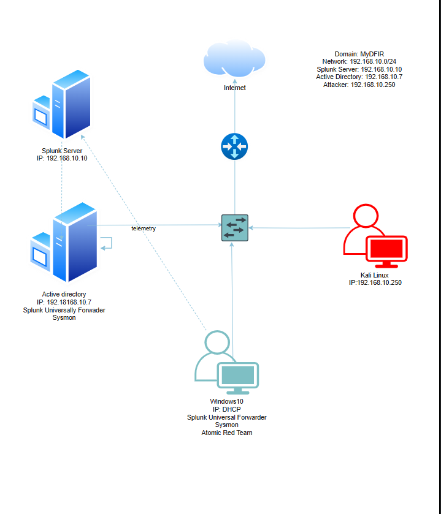

# 🧠 Active Directory Lab 1.0 — MyDFIR Home Lab Project

This project is a fully documented build of the **Active Directory Home Lab** tutorial series by **MyDFIR** on YouTube. The goal is to simulate a real-world enterprise AD environment using VirtualBox, providing hands-on experience with domain setup, network configuration, user management, and security monitoring.

> 🎥 [Watch the full YouTube series by MyDFIR](https://www.youtube.com/watch?v=5OessbOgyEo)

---

## 🎯 Purpose

As a cybersecurity student, I built this lab to deepen my understanding of Windows domain environments and Active Directory. Every step follows enterprise-style practices — from configuring NAT and DNS to simulating attacks — to prepare me for real-world IT and security roles. 

This lab also serves as a portfolio project to **demonstrate to hiring managers** that I can independently plan, configure, troubleshoot, and document an enterprise-style AD environment.

---

## 📘 Table of Contents

- [Part 0: Intro & Diagram Planning](./part0_intro.md)
- [Part 1: Domain Controller Setup](./part1_domain-controller.md)
- [Part 2: NAT & RAS](./part2_nat-setup.md)
- [Part 3: Users & OUs](./part3_users-and-ous.md)
- [Part 4: Client Machine Join](./part4_client-join-domain.md)
- [Part 5: Monitoring & Simulations](./part5_monitoring-and-attacks.md)

---

## 🧰 Tools & Technologies Used

| Tool                | Purpose                            |
|---------------------|------------------------------------|
| VirtualBox          | Virtual machine host               |
| Windows Server 2019 | Domain Controller OS               |
| Windows 10          | Client machine OS                  |
| draw.io             | Visual topology diagram            |
| Kali Linux          | Simulated attacker machine         |
| Sysmon              | Event log collection               |
| Splunk              | Log analysis and detection         |
| Atomic Red Team     | Simulated adversary techniques     |

---

## 🖼️ Lab Topology Diagram

> *Diagram created using draw.io – coming soon.*

```markdown

